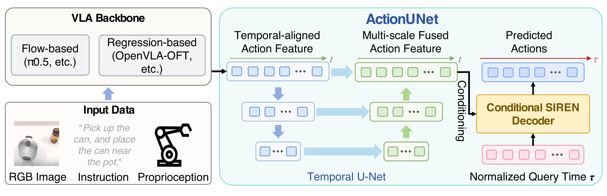

<div align="center">

<h2>ActionUNet: Improving Robustness of VLA Models with<br>Efficient Multi-scale Fine-tuning</h2>

<p>
  <b>Di Zhu</b><sup>1,*</sup> &middot;
  <b>Ziheng Yan</b><sup>1,*</sup> &middot;
  <b>Fang Wan</b><sup>1,&dagger;</sup>
</p>

<p><sup>1</sup>University of Chinese Academy of Sciences</p>

<p>
  <sup>*</sup>Equal contribution &middot;
  <sup>&dagger;</sup>Corresponding Author
</p>

<p><b>Official PyTorch implementation for NeurIPS 2026</b></p>

<a href="http://arxiv.org/abs/2609.34982"></a>

</div>

<p align="center">
  
</p>

ActionUNet adds a temporal U-Net and a conditional SIREN decoder to pretrained vision-language-action models for multi-scale, temporally smooth action generation. It supports both flow-based policies such as π0.5 and regression-based policies such as OpenVLA-OFT.

## Contents

- [Installation](#installation)
- [Model Preparation](#model-preparation)
- [LIBERO](#libero)
- [RoboTwin](#robotwin)
- [License](#license)
- [Acknowledgements](#acknowledgements)

Run the blocks in order in the same shell unless a new terminal is explicitly requested. Replace paths beginning with `/absolute/path/to/`.

## Installation

```bash
export ACTIONUNET_ROOT="$HOME/ActionUNet"

git clone https://github.com/Di-Zhu123/ActionUNet.git "$ACTIONUNET_ROOT"
cd "$ACTIONUNET_ROOT"

curl -LsSf https://astral.sh/uv/install.sh | sh
export PATH="$HOME/.local/bin:$PATH"

uv python install 3.11
uv sync --frozen

TRANSFORMERS_DIR="$(uv run python -c 'import pathlib, transformers; print(pathlib.Path(transformers.__file__).parent)')"
cp -a src/openpi/models_pytorch/transformers_replace/. "$TRANSFORMERS_DIR/"

uv run python -m actionunet.train --help
uv run python -m actionunet.serve --help
```

## Model Preparation

Convert the official JAX π0.5 checkpoint with the pinned OpenPI revision:

```bash
export OPENPI_CONVERTER_ROOT="$HOME/openpi-c23745b"
export JAX_CHECKPOINT="/absolute/path/to/jax/pi05_base"
export BASE_WEIGHTS="/absolute/path/to/pytorch/pi05_base"
export HF_LEROBOT_HOME="/absolute/path/to/lerobot"
export CHECKPOINT_ROOT="/absolute/path/to/actionunet_checkpoints"

git clone https://github.com/Physical-Intelligence/openpi.git "$OPENPI_CONVERTER_ROOT"
git -C "$OPENPI_CONVERTER_ROOT" checkout c23745b5ad24e98f66967ea795a07b2588ed6c79

cd "$ACTIONUNET_ROOT"
uv run python "$OPENPI_CONVERTER_ROOT/examples/convert_jax_model_to_pytorch.py" \
  --checkpoint-dir "$JAX_CHECKPOINT" \
  --config-name pi05_aloha \
  --output-path "$BASE_WEIGHTS" \
  --precision bfloat16

mkdir -p "$HF_LEROBOT_HOME" "$CHECKPOINT_ROOT"
test -f "$BASE_WEIGHTS/model.safetensors"
```

## LIBERO

### Data

```bash
cd "$ACTIONUNET_ROOT"

uv run hf download physical-intelligence/libero \
  --repo-type dataset \
  --local-dir "$HF_LEROBOT_HOME/physical-intelligence/libero"

export LIBERO_EXP="libero_actionunet"

uv run python -m actionunet.train pi05_libero \
  --exp-name "$LIBERO_EXP" \
  --checkpoint-root "$CHECKPOINT_ROOT" \
  --batch-size 256 \
  --compute-norm-stats
```

### Training

The published setting uses 8 GPUs, a global batch size of 256, and 40,000 steps.

```bash
cd "$ACTIONUNET_ROOT"

CUDA_VISIBLE_DEVICES=0,1,2,3,4,5,6,7 \
uv run torchrun \
  --standalone \
  --nnodes=1 \
  --nproc-per-node=8 \
  -m actionunet.train pi05_libero \
  --exp-name "$LIBERO_EXP" \
  --base-weights "$BASE_WEIGHTS" \
  --checkpoint-root "$CHECKPOINT_ROOT" \
  --batch-size 256 \
  --num-train-steps 40000 \
  --save-interval 5000
```

### Evaluation Environments

Create the standard LIBERO environment:

```bash
export LIBERO_ROOT="$HOME/LIBERO"
export LIBERO_VENV="$HOME/venvs/libero"

git clone https://github.com/Lifelong-Robot-Learning/LIBERO.git "$LIBERO_ROOT"
git -C "$LIBERO_ROOT" checkout f78abd68ee283de9f9be3c8f7e2a9ad60246e95c

python3.8 -m venv "$LIBERO_VENV"
source "$LIBERO_VENV/bin/activate"

cd "$ACTIONUNET_ROOT"
uv pip sync examples/libero/requirements.txt "$LIBERO_ROOT/requirements.txt" \
  --extra-index-url https://download.pytorch.org/whl/cu113 \
  --index-strategy unsafe-best-match
uv pip install -e packages/openpi-client
uv pip install -e "$LIBERO_ROOT"

deactivate

printf 'n\n' | LIBERO_CONFIG_PATH="$LIBERO_ROOT/.libero" \
  "$LIBERO_VENV/bin/python" -c 'import libero.libero'
```

Create a separate LIBERO-Plus environment:

```bash
export LIBERO_PLUS_ROOT="$HOME/LIBERO-plus"
export LIBERO_PLUS_VENV="$HOME/venvs/libero-plus"

sudo apt-get update
sudo apt-get install -y \
  libexpat1 \
  libfontconfig1-dev \
  libpython3-stdlib \
  libmagickwand-dev \
  unzip

git clone https://github.com/sylvestf/LIBERO-plus.git "$LIBERO_PLUS_ROOT"

python3.8 -m venv "$LIBERO_PLUS_VENV"
source "$LIBERO_PLUS_VENV/bin/activate"

python -m pip install -r "$LIBERO_PLUS_ROOT/requirements.txt"
python -m pip install -r "$LIBERO_PLUS_ROOT/extra_requirements.txt"
python -m pip install -e "$LIBERO_PLUS_ROOT"
python -m pip install -e "$ACTIONUNET_ROOT/packages/openpi-client"
python -m pip install 'tyro==0.9.2' 'imageio==2.35.1' 'imageio-ffmpeg==0.5.1'

python -c 'from wand.image import Image; print("MagickWand OK")'
deactivate

cd "$ACTIONUNET_ROOT"
uv run hf download Sylvest/LIBERO-plus assets.zip \
  --repo-type dataset \
  --local-dir "$LIBERO_PLUS_ROOT"
unzip -o "$LIBERO_PLUS_ROOT/assets.zip" -d "$LIBERO_PLUS_ROOT/libero/libero"

printf 'n\n' | LIBERO_CONFIG_PATH="$LIBERO_PLUS_ROOT/.libero" \
  "$LIBERO_PLUS_VENV/bin/python" -c 'import libero.libero; print("LIBERO-Plus imports OK")'
```

### Parallel Evaluation

The launcher starts one policy server and one simulator worker per GPU.

```bash
cd "$ACTIONUNET_ROOT"
export LIBERO_CHECKPOINT="$CHECKPOINT_ROOT/pi05_libero__actionunet/libero_actionunet/40000"

bash examples/libero/run_parallel_eval.sh \
  --benchmark libero \
  --checkpoint "$LIBERO_CHECKPOINT" \
  --gpus 0,1,2,3,4,5,6,7 \
  --sim-python "$LIBERO_VENV/bin/python" \
  --libero-config-path "$LIBERO_ROOT/.libero" \
  --output-dir "$ACTIONUNET_ROOT/eval/libero" \
  --base-port 8000
```

```bash
cd "$ACTIONUNET_ROOT"
export LIBERO_CHECKPOINT="$CHECKPOINT_ROOT/pi05_libero__actionunet/libero_actionunet/40000"
export LIBERO_PLUS_CLASSIFICATION="$LIBERO_PLUS_ROOT/libero/libero/benchmark/task_classification.json"

bash examples/libero/run_parallel_eval.sh \
  --benchmark libero-plus \
  --checkpoint "$LIBERO_CHECKPOINT" \
  --gpus 0,1,2,3,4,5,6,7 \
  --sim-python "$LIBERO_PLUS_VENV/bin/python" \
  --libero-config-path "$LIBERO_PLUS_ROOT/.libero" \
  --classification "$LIBERO_PLUS_CLASSIFICATION" \
  --output-dir "$ACTIONUNET_ROOT/eval/libero-plus" \
  --base-port 8100
```

Rerun the same command to resume an interrupted evaluation. Add `--retry-errors` only after fixing failed episodes.

## RoboTwin

### Data

Run the conversion commands in the official RoboTwin environment:

```bash
export ROBOTWIN_ROOT="$HOME/RoboTwin"
export TASK="move_can_pot"
export DATA_REPO="demo_clean_${TASK}_robotwin"

git clone --recurse-submodules https://github.com/RoboTwin-Platform/RoboTwin.git "$ROBOTWIN_ROOT"
cd "$ROBOTWIN_ROOT"
bash scripts/download_xpolicylab_data.sh

python XPolicyLab/scripts/transform_lerobot_v21_format.py \
  "demo_clean.${TASK}.aloha_agilex" \
  --repo_id "$DATA_REPO" \
  --max_episode 50

mkdir -p "$ROBOTWIN_ROOT/policy"
ln -s "$ACTIONUNET_ROOT" "$ROBOTWIN_ROOT/policy/actionunet"
```

Compute normalization statistics in the ActionUNet environment:

```bash
cd "$ACTIONUNET_ROOT"

uv run python -m actionunet.train pi05_aloha \
  --data-repo-id "$DATA_REPO" \
  --exp-name "$DATA_REPO" \
  --checkpoint-root "$CHECKPOINT_ROOT" \
  --batch-size 64 \
  --compute-norm-stats
```

### Training

The paper uses 2 GPUs, a global batch size of 64, and the same 8,000-step budget for all compared methods. Most RoboTwin tasks have not converged at 8,000 steps; this fixed budget is used because of time and compute constraints.

```bash
cd "$ACTIONUNET_ROOT"

CUDA_VISIBLE_DEVICES=0,1 \
uv run torchrun \
  --standalone \
  --nnodes=1 \
  --nproc-per-node=2 \
  -m actionunet.train pi05_aloha \
  --data-repo-id "$DATA_REPO" \
  --exp-name "$DATA_REPO" \
  --base-weights "$BASE_WEIGHTS" \
  --checkpoint-root "$CHECKPOINT_ROOT" \
  --batch-size 64 \
  --num-train-steps 8000 \
  --save-interval 2000
```

### Evaluation

Start the policy server in the ActionUNet environment:

```bash
cd "$ACTIONUNET_ROOT"
export TASK="move_can_pot"
export DATA_REPO="demo_clean_${TASK}_robotwin"
export ROBOTWIN_CHECKPOINT="$CHECKPOINT_ROOT/pi05_aloha__actionunet/${DATA_REPO}/7999"

uv run python -m actionunet.serve \
  --base-config pi05_aloha \
  --data-repo-id "$DATA_REPO" \
  --checkpoint "$ROBOTWIN_CHECKPOINT" \
  --device cuda:0 \
  --num-steps 10 \
  --host 127.0.0.1 \
  --port 8000
```

In another terminal, run both RoboTwin evaluation modes:

```bash
export ROBOTWIN_ROOT="$HOME/RoboTwin"
export TASK="move_can_pot"
export DATA_REPO="demo_clean_${TASK}_robotwin"

cd "$ROBOTWIN_ROOT"

for MODE in demo_clean demo_randomized; do
  python script/eval_policy.py \
    --config policy/actionunet/robotwin_deploy.yml \
    --overrides \
    --task_name "$TASK" \
    --task_config "$MODE" \
    --ckpt_setting "${DATA_REPO}_step7999" \
    --host 127.0.0.1 \
    --port 8000 \
    --action_chunk 50
done
```

## License

This project is released under the [Apache License 2.0](LICENSE). Gemma components are subject to [LICENSE_GEMMA.txt](LICENSE_GEMMA.txt).

## Acknowledgements

This project builds on [OpenPI](https://github.com/Physical-Intelligence/openpi), [LIBERO](https://github.com/Lifelong-Robot-Learning/LIBERO), [LIBERO-Plus](https://github.com/sylvestf/LIBERO-plus), and [RoboTwin](https://github.com/RoboTwin-Platform/RoboTwin).
